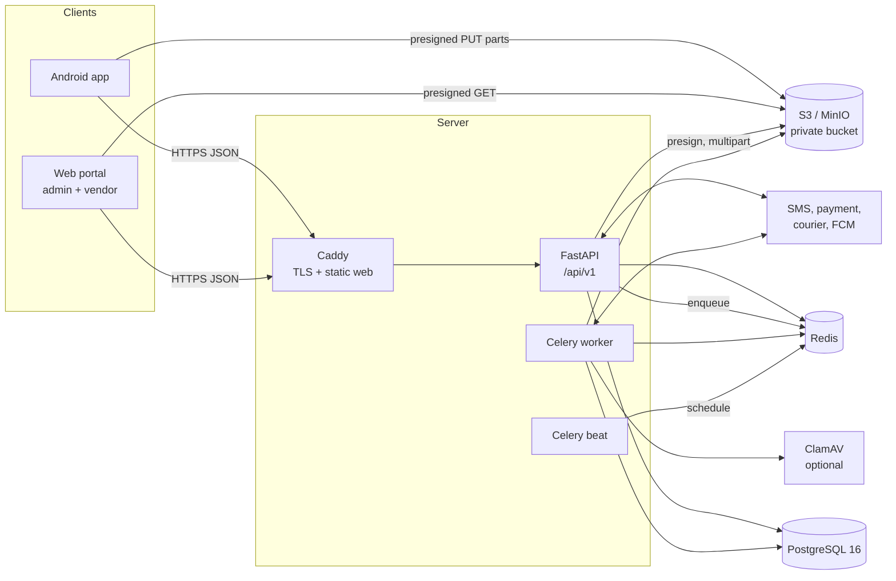
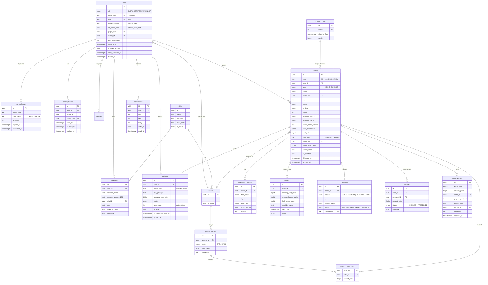
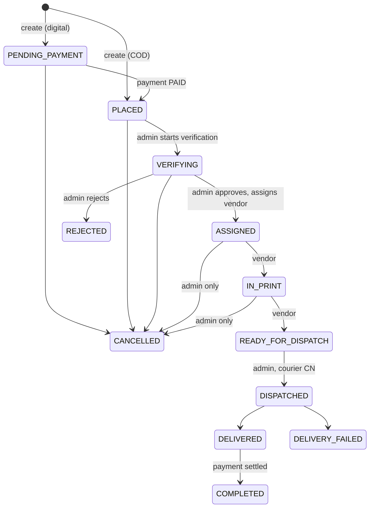
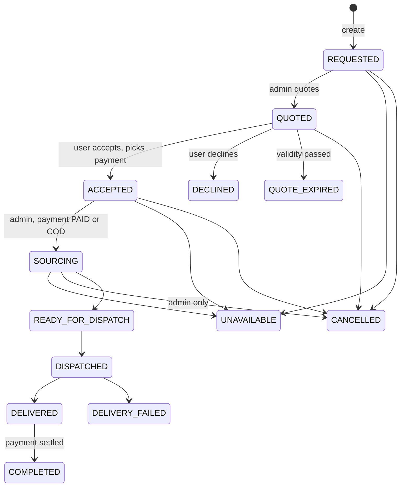
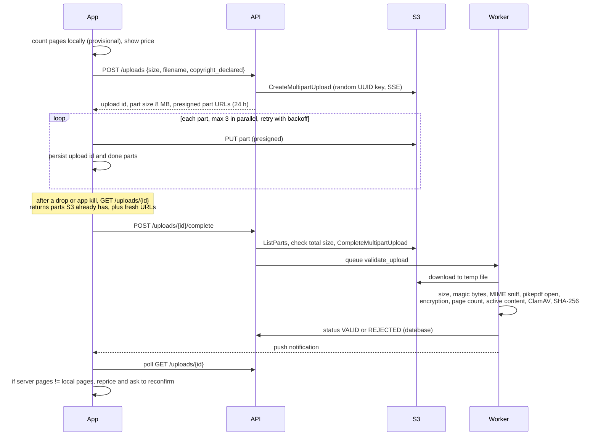

# KitaabOnDemand architecture

KitaabOnDemand lets customers in Pakistan either have a book found and delivered
(`SOURCE`, Pathway 1) or upload their own PDF to be printed and delivered
(`PRINT`, Pathway 2). Three clients share one backend:

| Component | Path | Users |
|---|---|---|
| Android app (Flutter) | `apps/mobile` | Customers |
| Web portal (React) | `apps/web` | Admins (`/admin`) and print vendors (`/vendor`) |
| API, worker and scheduler (FastAPI and Celery) | `services/api` | All clients, couriers, payment gateways |
| Contracts | `packages/contracts` | OpenAPI export, shared pricing test vectors |
| Infrastructure | `infra` | Dockerfiles, Compose, Caddy, Terraform |

The first release targets Android only. iOS and Sign in with Apple are deferred
(see `DECISIONS.md`, D-002).

## 1. System overview



Key points:

- **PDF bytes never pass through the API.** The app uploads 8 MB parts
  directly to S3 using presigned URLs. The API only creates the multipart
  upload, signs parts and completes it. This keeps API workers small and lets
  uploads resume after network drops.
- **Synchronous SQLAlchemy.** Because file transfer bypasses the API, the API
  is ordinary request/response work. Sync SQLAlchemy 2 with psycopg 3 is
  simpler for a small team, and the same code runs inside Celery tasks
  (D-010).
- **Domain logic is plain Python.** Pricing, the order state machine, upload
  validation, the ledger and the purge job are functions that take a database
  session, a `Clock` and provider objects. HTTP handlers and Celery tasks are
  thin wrappers around them, so everything time-dependent is testable with a
  fake clock.
- **Providers are swappable.** SMS, payments, couriers, push, object storage
  and virus scanning sit behind small interfaces, selected by environment
  variable. Mocks power development, tests and `make demo` (see
  `INTEGRATIONS.md`).

## 2. Backend module layout

```
services/api/src/kitaab/
  main.py              app factory, middleware, error handlers
  config.py            Settings (pydantic-settings) and production safety checks
  clock.py             Clock protocol, SystemClock, OffsetClock (dev/e2e), FrozenClock (tests)
  db.py                engine and session
  problems.py          RFC 7807 errors
  logging.py           JSON logs, request IDs, PII masking
  money.py, phone.py   paisa formatting, Pakistani phone normalisation
  security/            JWT, passwords, TOTP, rate limits, dependencies (current user, role checks)
  models/              SQLAlchemy models (one file per aggregate)
  schemas/             Pydantic request/response models (the OpenAPI contract)
  domain/
    pricing.py         price calculator (shared vectors)
    orders/            state machine table, transition service, timeline mapping
    quotes.py, ledger.py, purge.py, uploads.py, auth.py, accounts.py
  api/v1/              routers: auth, me, cities, pricing, uploads, orders, notifications,
                       webhooks, admin/*, vendor/*, dev (non-production only)
  providers/           sms, payment, courier, push, storage, antivirus, id_tokens
  pdf/                 validation (pikepdf, python-magic), packing slip (reportlab)
  workers/             Celery app, tasks, beat schedule
  cli.py               migrate helpers, seed, create-admin, create-vendor-user
```

## 3. Data model (ERD)

All primary keys are UUIDs. Money columns end in `_paisa` and are integers.
All timestamps are `timestamptz` stored in UTC.



Tables not drawn above: `devices` (push tokens), `webhook_events`
(idempotency keys for payment and courier webhooks), `audit_logs` (admin
actions, PDF downloads, purge runs, settings changes) and `app_settings`
(admin-editable settings such as `COD_MAX_ORDER_VALUE`).

`ledger_entries` is append-only. A database trigger rejects `UPDATE` and
`DELETE`. Corrections are new entries.

## 4. Order state machines

All transitions live in one table in `kitaab/domain/orders/state_machine.py`.
Each row has the from-state, the to-state, the actors allowed to make it, an
optional guard and the side effects. The transition service locks the order
row (`SELECT … FOR UPDATE`), checks the table, applies the change, writes a row
to `order_status_history` and runs the side effects in the same database
transaction. Notifications and webhooks to third parties are queued and sent
after commit.

Actors: `USER` (the order's owner), `ADMIN`, `VENDOR` (the assigned vendor
only), `SYSTEM` (payment webhooks, courier updates, scheduled jobs).

### 4.1 PRINT



| From | To | Actors | Guard | Side effects |
|---|---|---|---|---|
| — (create, COD) | PLACED | USER | upload `VALID`, price matches, COD allowed | notify user |
| — (create, digital) | PENDING_PAYMENT | USER | upload `VALID`, price matches | create payment session |
| PENDING_PAYMENT | PLACED | SYSTEM | payment `PAID` | notify user |
| PENDING_PAYMENT | CANCELLED | USER, ADMIN, SYSTEM | — | refund if paid, notify |
| PLACED | VERIFYING | ADMIN | — | — |
| PLACED | CANCELLED | USER, ADMIN | — | refund if paid, notify, start terminal purge timer |
| VERIFYING | ASSIGNED | ADMIN | active vendor and vendor cost given | record vendor and cost, notify |
| VERIFYING | REJECTED | ADMIN | reason given | refund if paid, notify, start terminal purge timer |
| VERIFYING | CANCELLED | USER, ADMIN | — | refund if paid, notify, start terminal purge timer |
| ASSIGNED | IN_PRINT | VENDOR, ADMIN | — | notify |
| ASSIGNED | CANCELLED | ADMIN | reason given | refund if paid, notify, start terminal purge timer |
| IN_PRINT | READY_FOR_DISPATCH | VENDOR, ADMIN | — | accrue vendor cost |
| IN_PRINT | CANCELLED | ADMIN | reason given | refund if paid, notify, start terminal purge timer |
| READY_FOR_DISPATCH | DISPATCHED | ADMIN | courier and CN present | notify with tracking link |
| DISPATCHED | DELIVERED | SYSTEM, ADMIN | — | set `delivered_at` (purge timer), COD collected entry, notify, try to complete |
| DISPATCHED | DELIVERY_FAILED | SYSTEM, ADMIN | — | notify |
| DELIVERED | COMPLETED | SYSTEM | payment `PAID` | — |

### 4.2 SOURCE



| From | To | Actors | Guard | Side effects |
|---|---|---|---|---|
| — (create) | REQUESTED | USER | address and book details | — |
| REQUESTED | QUOTED | ADMIN | quote fields valid | create quote, push and inbox notice |
| REQUESTED | UNAVAILABLE | ADMIN | reason given | notify |
| QUOTED | ACCEPTED | USER | quote still valid, COD allowed if COD | set price and payment method, create payment, notify |
| QUOTED | DECLINED | USER | — | close quote |
| QUOTED | QUOTE_EXPIRED | SYSTEM | `valid_until` passed | close quote, notify |
| REQUESTED, QUOTED, ACCEPTED | CANCELLED | USER, ADMIN | — | refund if paid, notify |
| ACCEPTED | SOURCING | ADMIN | payment `PAID`, or method COD | optional vendor and cost, notify |
| ACCEPTED, SOURCING | UNAVAILABLE | ADMIN | reason given | refund if paid, notify |
| SOURCING | CANCELLED | ADMIN | reason given | refund if paid, notify |
| SOURCING | READY_FOR_DISPATCH | ADMIN, VENDOR | vendor must be the assigned one | accrue vendor cost if a vendor is assigned |
| READY_FOR_DISPATCH | DISPATCHED | ADMIN | courier and CN present | notify with tracking link |
| DISPATCHED | DELIVERED | SYSTEM, ADMIN | — | as PRINT |
| DISPATCHED | DELIVERY_FAILED | SYSTEM, ADMIN | — | notify |
| DELIVERED | COMPLETED | SYSTEM | payment `PAID` | — |

### 4.3 Completion and payment settlement

`COMPLETED` is set by the system when the order is `DELIVERED` and its payment
is `PAID`. Digital payments are `PAID` before delivery, so the order completes
right after delivery. A COD payment becomes `PAID` when an admin marks the cash
as remitted by the courier in the COD panel, and the order completes then.

### 4.4 Customer timeline

The app always shows the same steps. The server computes the timeline and
returns it with each order, so the app holds no mapping logic.

| Step | PRINT states | SOURCE states |
|---|---|---|
| Order Placed | PLACED | REQUESTED |
| Verifying / Sourcing | VERIFYING, ASSIGNED | QUOTED, ACCEPTED, SOURCING, READY_FOR_DISPATCH |
| Printing | IN_PRINT, READY_FOR_DISPATCH | hidden |
| Out for Delivery | DISPATCHED | DISPATCHED |
| Completed | DELIVERED, COMPLETED | DELIVERED, COMPLETED |

`PENDING_PAYMENT` shows "Awaiting payment" above the timeline. Exit states
(`REJECTED`, `CANCELLED`, `QUOTE_EXPIRED`, `DECLINED`, `UNAVAILABLE`,
`DELIVERY_FAILED`) keep the steps already reached and show a banner with the
reason.

## 5. Pricing

```
goods  = ceil_to_rupee((pages * rate_per_page[paper] + binding_fee[binding]) * copies [+ sourcing_cost])
total  = goods + delivery_fee[city_zone] + (cod_fee if payment == COD)
```

- All values are integer paisa. `ceil_to_rupee` rounds up to the next multiple
  of 100 paisa.
- `rate_per_page` may have volume brackets keyed on printed pages
  (`pages * copies`). The highest bracket whose `min_printed_pages` is at most
  the volume wins (D-014).
- Each binding has an optional `max_pages`.
- For `SOURCE` quotes, the admin's sourcing cost is added before rounding, and
  the admin may override `goods` with a reason. Delivery and COD fees still
  come from the config.
- Configs are versioned rows in `pricing_configs` with an `effective_from`
  date. The active config is the highest version already in effect. Every
  order stores the version and the full line breakdown.
- The app computes prices instantly from `GET /api/v1/pricing/config`. The
  server recomputes on order creation and rejects a mismatched
  `expected_total_paisa` with `409 price-mismatch`.
- `packages/contracts/pricing_vectors.json` holds input/output cases that both
  the Python and the Dart test suites run.

## 6. PDF upload pipeline



Size is enforced four times: the declared size at creation (at most 150 MB),
the number of part URLs issued (`ceil(size / 8 MB)`), the summed part sizes
from `ListParts` before completion, and the object size the worker reads.

## 7. Authentication

| Who | Method | Tokens |
|---|---|---|
| Customer | Phone OTP, or Google ID token then phone OTP before first order | Access JWT (15 min) plus rotating refresh token |
| Vendor staff | Email and password (argon2), lockout | Same |
| Admin | Email, password and TOTP (mandatory), lockout | Same |
| Store reviewer | Fixed phone and OTP when `REVIEW_MODE_ENABLED=true` | Same |

Refresh tokens are random, stored as SHA-256 hashes and grouped into families.
Each refresh marks the old token used and issues a new one. Presenting a used
token revokes the whole family (reuse detection).

The web portal keeps the access token in memory and the refresh token in
`sessionStorage`. The app keeps both in `flutter_secure_storage`.

## 8. Background jobs

| Job | Schedule | Purpose |
|---|---|---|
| `validate_upload` | on upload completion | PDF validation pipeline |
| `send_notification` | after commit | push, inbox, optional SMS fallback |
| `expire_quotes` | every 5 min | `QUOTED` to `QUOTE_EXPIRED` |
| `expire_pending_payments` | every 15 min | cancel `PENDING_PAYMENT` orders older than 24 h |
| `poll_courier_status` | every 30 min | for couriers without webhooks |
| `purge_files` | hourly | storage auto-purge (section 9) |

## 9. Storage auto-purge

The hourly job deletes:

1. PDFs of orders delivered more than `PURGE_DAYS` (default 7) days ago.
2. PDFs of `CANCELLED` or `REJECTED` orders more than `PURGE_DAYS` after they
   reached that state (D-016).
3. Uploads never attached to an order, 24 hours after creation, including
   unfinished multipart uploads.
4. Shipping details of orders belonging to deleted accounts, once the order
   is terminal (D-019).

For each file it deletes all object versions, aborts stray multipart uploads,
sets `object_key` to null and `purged_at` to now, and keeps the page count,
hash and financial data. Each run writes one audit log row with counts. With
`PURGE_DRY_RUN=true` it reports and changes nothing. An S3 lifecycle rule aborts
incomplete multipart uploads after 2 days as a safety net.

## 10. Environments and configuration

All configuration comes from environment variables and is validated at
startup (`kitaab/config.py`). With `ENVIRONMENT=production` the API refuses to
start if debug is on, review mode is on without the explicit override, dev
tools are on, mock providers are selected, CORS allows `*`, or secrets are
missing or are development defaults.

| Environment | Providers | Clock | Dev endpoints |
|---|---|---|---|
| `development` | mocks | system plus optional offset (Redis) | on |
| `test` | mocks and fakes | frozen or offset | on |
| `staging` | real or mocks | system | off |
| `production` | real | system | off, enforced |

## 11. Assumptions

Each assumption is also a dated entry in `DECISIONS.md`.

1. The brief is the full specification because `docs/PRD.md` was not provided
   (D-001).
2. The first release is Android only. Sign in with Apple and iOS builds are
   deferred (D-002).
3. A `PENDING_PAYMENT` state comes before `PLACED` for PRINT orders paid
   digitally (D-011).
4. PRINT review: "Start verification" moves `PLACED` to `VERIFYING`.
   "Approve" assigns the vendor and moves to `ASSIGNED` (D-012).
5. The customer sees `DELIVERED` as the final "Completed" step. Internal
   completion waits for payment settlement (D-013).
6. Volume brackets are keyed on printed pages (`pages * copies`) (D-014).
7. Vendor cost is accrued when the vendor marks the order ready for dispatch,
   not at assignment (D-015).
8. Files of cancelled or rejected orders are purged `PURGE_DAYS` after the
   terminal state (D-016).
9. Revenue is recognised when a digital payment is `PAID`, or when the courier
   collects COD on delivery (D-017).
10. Times are shown at a fixed UTC+05:00. Pakistan has not observed daylight
    saving since 2009 (D-018).
11. Account deletion removes personal data and files at once, except data an
    in-flight order needs, which is scrubbed when the order becomes terminal
    (D-019).
12. Review mode is refused in production unless
    `ALLOW_REVIEW_MODE_IN_PRODUCTION=true` is also set for the store review
    window (D-020).
13. Rupee amounts use Western digit grouping: `Rs. 1,250` and
    `Rs. 1,250,000` (D-021).
14. A `SOURCE` request includes the delivery address so the quote can show
    the delivery fee (D-022).
