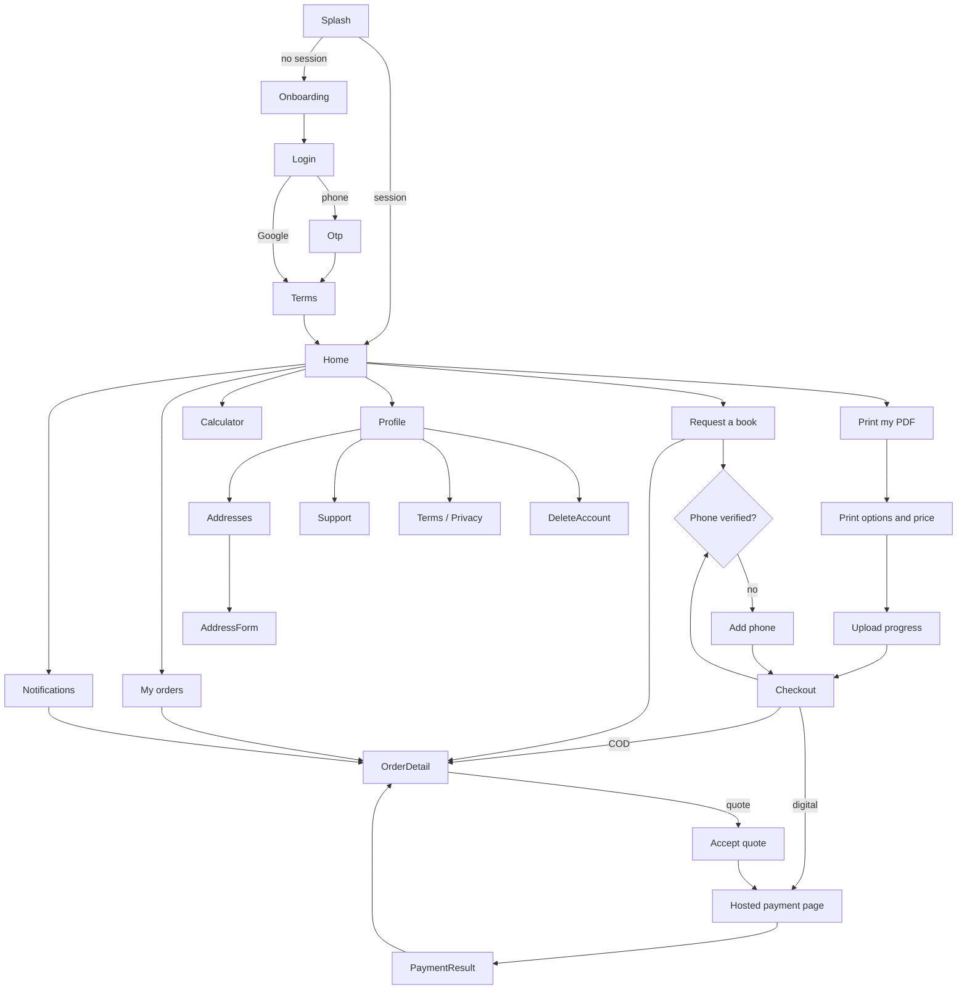

# Screens

The inventory a designer needs to produce visual designs. It lists every
screen, how screens connect, the fields on each and the states each must
handle. The clickable stubs in `apps/mobile` and `apps/web` follow this
document. Figma files can be made from it later.

Common rules:

- **Copy** is short and plain. All app strings live in
  `apps/mobile/lib/l10n/app_en.arb` so they can be translated to Urdu later.
- **Money** is shown as `Rs. 1,250`. **Times** are shown in Pakistan time, for
  example `9 Oct, 3:45 pm`.
- **Touch targets** are at least 48 × 48 dp. Text must still fit at 200% font
  scale. Layouts must work right-to-left (Urdu) without changes.
- **Every data screen** has four states: loading (skeleton or spinner),
  content, empty (with a next step) and error (plain message plus a Retry
  button). Offline shows a banner and keeps typed input.

## 1. Android app

### 1.1 Navigation map



Bottom navigation on signed-in screens: **Home**, **Orders**, **Inbox**,
**Profile**. The Android back button goes up one level. On Home it exits the
app. On the upload screen it asks before leaving, and the upload keeps
resuming in the background.

Push notifications and deep links (`kitaab://orders/{id}`) open Order detail
directly.

### 1.2 Screens

| # | Screen | Purpose | Fields and content | States and edge cases |
|---|---|---|---|---|
| M1 | Splash | Restore session | Logo | Session expired: go to Login. No network: continue offline with cached data. |
| M2 | Onboarding | Explain the two services | 3 slides: "Find any book", "Print your PDF", "Delivered to your door, pay cash on delivery". Get started button | Shown once. Skip button. |
| M3 | Login | Start sign-in | Phone (`0300 1234567`), Send code, Continue with Google | Invalid number inline. Rate-limited: "Too many attempts, try again in N minutes." |
| M4 | OTP | Verify phone | 6 single-digit boxes (SMS autofill), resend link with 60 s countdown, change number link | Wrong code: "Wrong code. N attempts left." Expired: "Code expired. Send a new one." Locked: wait message. |
| M5 | Terms | Accept terms on first sign-in | Short summary, links to Terms and Privacy, "I agree" checkbox, Continue | Continue disabled until checked. |
| M6 | Add phone | Google users must verify a phone before ordering | Phone field, Send code, then OTP boxes | Same as M3 and M4. Number already used by another account: explain and offer support. |
| M7 | Home | Choose a service | Greeting, two large cards ("Find a book", "Print my PDF"), price calculator link, latest active order card with its status, notification bell with unread badge | No orders: hide the order card. |
| M8 | Request a book | SOURCE request | Book title (required), author, ISBN, edition, notes, copies (stepper, 1–50), preferred paper and binding (optional), delivery address (picker), Submit | Missing address: add one inline. Success: "We are looking for your book. We will send you a price within 48 hours." Then Order detail. |
| M9 | Print my PDF | Pick the file | Pick PDF button, file name and size, page count (read on device, or a field when it cannot be read), copyright declaration checkbox (required), Continue | Over 150 MB: blocked before upload. Not a PDF: blocked. Password-protected: manual page count, and the server will reject it, so warn now. |
| M10 | Print options | Choose options and see the price | Paper (Local White, Imported Yellow), binding (Softcover Paperback, Premium Hardcover), copies, delivery city (from address), live price breakdown (printing, binding, delivery, COD fee, total) | Pages above the binding maximum: inline error and suggest the other binding. Pricing config not loaded: retry. |
| M11 | Upload | Upload and validate | Progress bar with percentage and MB sent, part count, Pause / Resume, status text: Uploading, Checking file, Ready | Network drop: "Waiting for connection, upload will resume". App killed: resumes on next open. Rejected: reason (corrupt, password-protected, no pages, unsafe content, too large) and "Choose another file". Page count differs: dialog with old and new price, Confirm or Cancel. |
| M12 | Checkout | Confirm and place | Order summary, address card (change), payment method (Cash on delivery, Easypaisa, JazzCash, Card), price breakdown, Place order | COD over the limit: COD disabled with reason. Server price differs (`price-mismatch`): show the new total and ask to confirm. Double tap: button disabled while submitting. |
| M13 | Payment result | Return from hosted checkout | Success: "Payment received" then Order detail. Failure: reason, Try again, Choose another method | Result unknown yet: "Checking payment…" with polling. |
| M14 | Calculator | Price before ordering | Pages, paper, binding, copies, city, live breakdown | Same validation as M10. |
| M15 | My orders | Track orders | Tabs Active and Past. Each row: title or file name, order code, status chip, total, date | Empty: "No orders yet" plus the two service buttons. Paginated by scrolling. Pull to refresh. |
| M16 | Order detail | One order | Status timeline (Order Placed, Verifying or Sourcing, Printing (PRINT only), Out for Delivery, Completed), exit banner (rejected, cancelled, expired…) with reason, quote card, tracking card (courier, CN, Track link), price breakdown, delivery address, payment status, Cancel order (when allowed), Pay now (pending payment) | Quote card: price for digital vs cash, valid-until time, Accept (choose payment) and Decline. Quote expired: banner and "Request again". |
| M17 | Inbox | Notifications | List of title, body and time. Unread rows are bold. "Mark all read" | Empty: "No notifications yet". Tap opens the order. |
| M18 | Profile | Account | Name (editable), phone, Addresses, Support, Terms, Privacy, Delete account, Sign out, app version | — |
| M19 | Addresses | Manage addresses | List of cards (recipient, city, area, landmark), Add, Edit, Delete, Set default | Empty: "Add an address to order". |
| M20 | Address form | Add or edit | Recipient name, recipient phone, city (dropdown), area, street address, nearest landmark (prominent, with hint "e.g. near Jamia Masjid"), label, default switch | Inline validation. Phone normalised to +92. |
| M21 | Support | Contact us | Call, WhatsApp, Email, support hours | Opens the dialer, WhatsApp or the mail app. |
| M22 | Terms / Privacy | Read legal text | Title, version, scrollable text | Loaded from the API so the owner can update it without a new app release. |
| M23 | Delete account | Remove account | What is deleted and what is kept, list of orders that will be cancelled, type DELETE to confirm, Delete button | Orders in progress: explained, they are delivered first. Success: signed out with a confirmation. |

## 2. Web portal

One app at `/` with role-gated areas. Desktop-first, usable on a tablet.
Plain tables with search, filters and pagination.

### 2.1 Navigation map

```mermaid
flowchart LR
  Login -->|admin| AdminOrders
  Login -->|vendor| Queue
  subgraph Admin [/admin]
    AdminOrders[Orders] --> AdminOrder[Order detail]
    Vendors --> VendorUsers[Vendor users]
    Staff
    Customers --> Customer
    Pricing --> PricingNew[New pricing version]
    Cities
    Finance[Finance: revenue, COD, payouts, refunds]
    Audit[Audit log]
    Settings
  end
  subgraph Vendor [/vendor]
    Queue[Print queue] --> VendorOrder[Order detail]
  end
```

### 2.2 Screens

| # | Screen | Fields and content | Actions | States |
|---|---|---|---|---|
| W1 | Sign in | Email, password, then authenticator code for admins | Sign in | Wrong details, account locked (with unlock time), code required. |
| A1 | Orders | Table: code, type, status, customer, city, copies, total, payment, vendor, created. Filters: type, status (multi), search (code, phone, name), date range. Quick tabs: To verify, To quote, Ready to dispatch, All | Open order | Empty per filter. Review-account orders carry a "TEST" badge. |
| A2 | Order detail (PRINT) | Customer, file (name, size, server pages vs app pages, SHA-256), options, price breakdown, payment, address, history | Open PDF (5-minute link), Start verification, Approve and assign (vendor dropdown, vendor cost), Reject (reason), Cancel (reason), Mark printing or ready (on behalf of the vendor), Dispatch (courier, or manual CN), Mark delivered or failed, Packing slip, Refund | Actions shown only when allowed by the state machine. File purged: shows when. |
| A3 | Order detail (SOURCE) | Book request, preferences, quote history | Quote form (pages, paper, binding, copies, sourcing cost, override with reason, validity), Preview price, Send quote, Start sourcing (optional vendor), Mark unavailable, then the same dispatch actions | Quote expired or declined: shown in history. Payment pending blocks Start sourcing. |
| A4 | Vendors | Table: name, contact, city, active | Add, Edit, Deactivate, Manage users (create login and show temporary password once) | — |
| A5 | Staff | Admins: email, name, active, locked | Add admin (shows temporary password and authenticator QR once), Deactivate, Unlock | — |
| A6 | Customers | Read-only. Search by phone or name. Masked phone in the list, full in the detail. Orders list | — | Deleted accounts marked. |
| A7 | Pricing | Version history (version, effective from, notes, by whom, active) | New version: an editable form of every rate, bracket, fee and the delivery fee per zone, effective-from date, notes | Validation errors from the server shown per field. |
| A8 | Cities | Table: name, province, zone code, active, sort order | Add, Edit | Zone without a delivery fee: warning. |
| A9 | Finance: daily revenue | Date range. Table by date and payment method: orders, gross, refunds, net. Totals | Export CSV | — |
| A10 | Finance: COD pending | Grouped by courier: orders, CN, amount, delivered at. Group total | Select orders, Mark remitted (reference), Export CSV | — |
| A11 | Finance: vendor payouts | Per vendor: accrued, paid, in open batches, owed. Batches list | Create batch, Mark paid (reference), Export CSV | — |
| A12 | Finance: refunds | Pending and processed refunds | Mark processed (reference) | — |
| A13 | Audit log | Time, actor, action, entity, details. Filters | — | — |
| A14 | Settings | COD max order value (blank means off), default quote validity, support phone, WhatsApp, email, hours | Save | — |
| V1 | Print queue | Assigned orders: code, type, status, pages, paper, binding, copies, city, COD to collect. Filter by status | Open | Empty: "No orders assigned to you". |
| V2 | Vendor order detail | Options, recipient, address, landmark, COD amount, CN if dispatched | Download PDF (logged), Packing slip, Start printing (ASSIGNED), Ready for dispatch (IN_PRINT or SOURCING) | Buttons only move forward. File purged: download hidden. |

### 2.3 Packing slip (PDF, A5)

Order code (large) with a barcode, recipient name and phone, full address with
city and nearest landmark, copies, paper and binding, courier and CN barcode
when dispatched, and **COD to collect** in large type (or "PAID").
